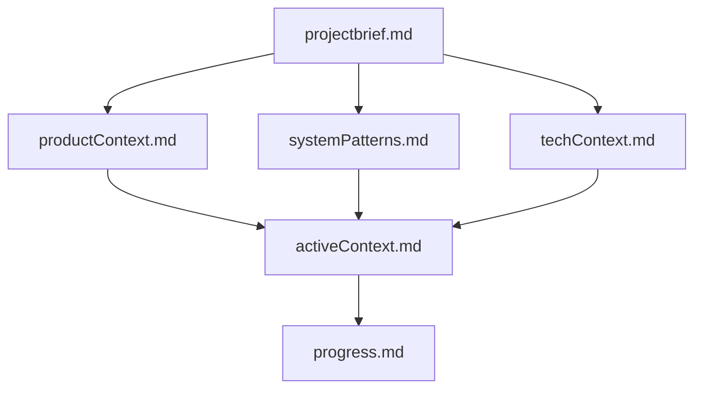
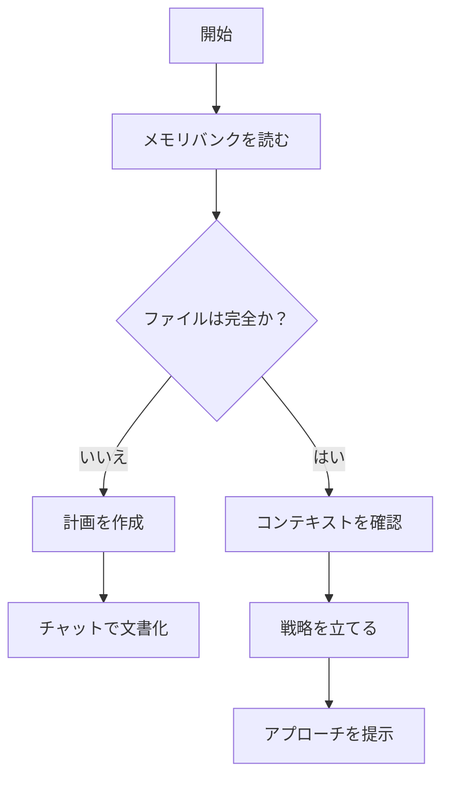
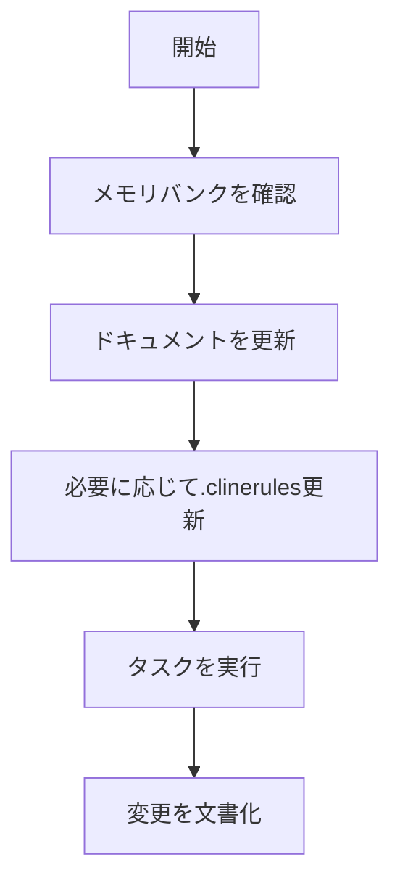
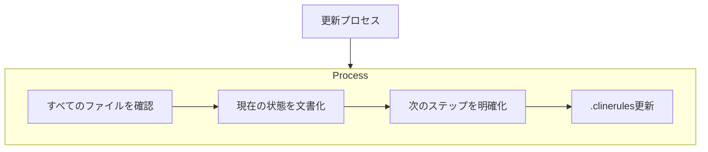
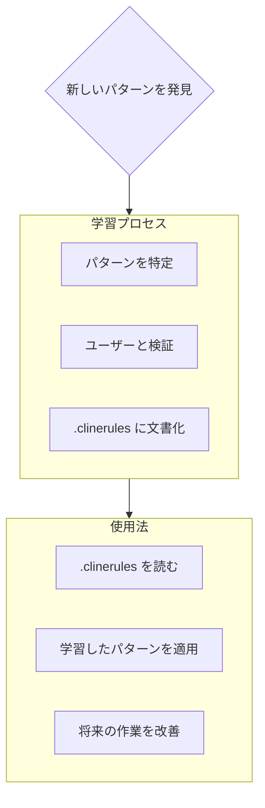

# メモリバンクガイド

## 概要
メモリバンクは、プロジェクトの知識を保持し、セッション間で一貫した理解を維持するための重要な仕組みです。すべてのタスクの開始時にメモリバンクファイルを読み込み、プロジェクトの現状と背景を理解します。

## メモリバンク構造

メモリバンクは必須のコアファイルとオプションのコンテキストファイルで構成され、すべてMarkdown形式です。ファイルは明確な階層構造を持ちます：

### コアファイル（必須）
1. `projectbrief.md`
   - 他のすべてのファイルの基盤となる文書
   - プロジェクト開始時に作成
   - コア要件と目標を定義
   - プロジェクト範囲の真実の源

2. `productContext.md`
   - このプロジェクトが存在する理由
   - 解決する問題
   - どのように機能すべきか
   - ユーザー体験の目標

3. `activeContext.md`
   - 現在の作業の焦点
   - 最近の変更
   - 次のステップ
   - アクティブな決定事項と考慮事項

4. `systemPatterns.md`
   - システムアーキテクチャ
   - 重要な技術的決定
   - 使用中の設計パターン
   - コンポーネント間の関係

5. `techContext.md`
   - 使用されている技術
   - 開発セットアップ
   - 技術的制約
   - 依存関係

6. `progress.md`
   - 動作している機能
   - 構築すべき残りの部分
   - 現在のステータス
   - 既知の問題

### 追加コンテキスト
以下を整理するために、memory-bank/ 内に追加のファイル/フォルダを作成します：
- 複雑な機能のドキュメント
- 統合仕様
- APIドキュメント
- テスト戦略
- デプロイ手順

## コアワークフロー

### プランモード

### アクトモード

## ドキュメント更新

メモリバンクの更新は以下の場合に行います：
1. 新しいプロジェクトパターンの発見時
2. 重要な変更の実装後
3. ユーザーが**update memory bank**をリクエストしたとき（すべてのファイルを確認すること）
4. コンテキストの明確化が必要なとき

注：**update memory bank**がトリガーされた場合、一部が更新を必要としない場合でも、すべてのメモリバンクファイルを確認する必要があります。特に現在の状態を追跡するactiveContext.mdとprogress.mdに焦点を当てます。

## プロジェクトインテリジェンス（.clinerules）

.clinerules ファイルは各プロジェクトの学習ジャーナルであり、コードだけでは明らかでない重要なパターン、設定、プロジェクトインテリジェンスを捉えます。ユーザーとプロジェクトの作業を通じて、重要な洞察を発見して文書化します。

### 捕捉すべき内容
- 重要な実装パス
- ユーザーの設定とワークフロー
- プロジェクト固有のパターン
- 既知の課題
- プロジェクト決定の進化
- ツール使用パターン

フォーマットは柔軟です - ユーザーとプロジェクトとより効果的に連携するのに役立つ貴重な洞察を捉えることに焦点を当てます。.clinerules はユーザーとの協力を通じてより賢くなっていく生きたドキュメントと考えてください。
